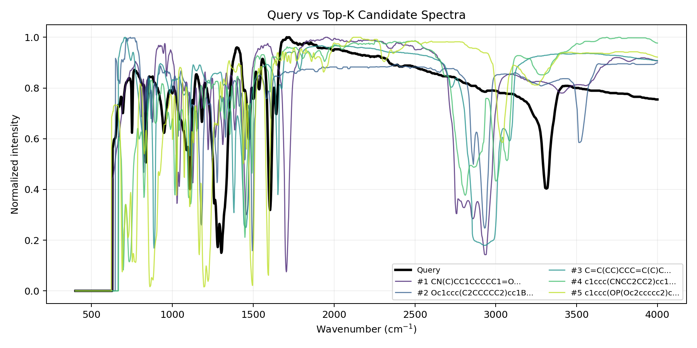
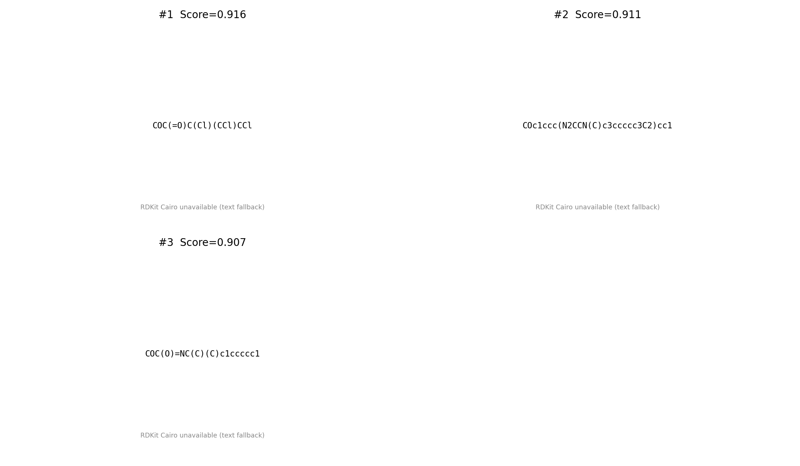
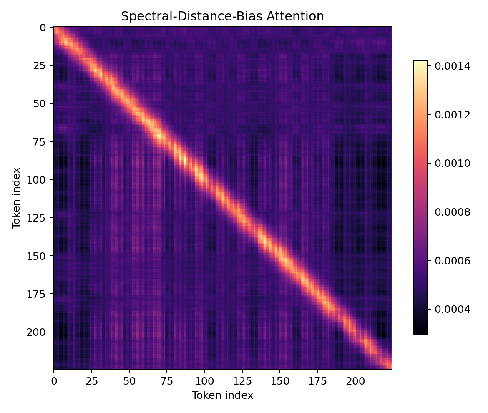

# MultiSpec-GeoDiff — Demo 说明

<div class="info-box">

**项目名称：** MultiSpec-GeoDiff
**提交类型：** DP Technology 实习项目 Demo
**当前阶段：** Stage-I 可行性闭环
**数据：** 200 条 NIST 实验 IR 光谱
**主入口：** [https://github.com/techandscixie2005/MultiSpec-GeoDiff-Demo](https://github.com/techandscixie2005/MultiSpec-GeoDiff-Demo)

**一键运行：**
```
python 03_code/run_demo.py --query_id 0 --data 04_data/IR_nist_200.jsonl --top_k 5
```

</div>

---

## 1. 任务目标、定位与价值

本 Demo 对应提交的项目提议 **"MultiSpec-GeoDiff: 多模态谱图驱动的几何分子结构反演"**（详见 `01_project_proposal/proposal.md`）。

完整提议覆盖从多模态谱图编码、图扩散生成、pairwise 距离预测到 SE(3) 等变细化的端到端管线。本次提交聚焦于 **Stage-I 可行性闭环**：

```
实验 IR 光谱 → 坐标感知谱图编码 → 候选检索 → 前向谱图重排 → Top-K 候选分子
```

**定位说明：** 本 Demo 不是训练完备的生成模型，也不是生产级未知物鉴定系统。它展示的是一个**可追溯的 AI-for-Science 工作流**：在真实实验数据上验证"候选提出 + 前向一致性校验"的闭环思想。GitHub 仓库是主要提交入口，本 PDF 为 reviewer 提供配套说明。

---

## 2. 已完成核心能力

以下模块已在 Stage-I 中实现，均可通过命令行复现：

| 能力模块 | 当前实现 | 证明材料 |
|---|---|---|
| NIST IR 数据加载 | 200 条实验光谱，含 SMILES / 波数 / 强度 | `04_data/IR_nist_200.jsonl` |
| 谱图预处理 | 公共网格插值 (400--4000 cm$^{-1}$, 1800 点) + 归一化 + 峰提取 | `spectra_preprocess.py` |
| 坐标感知谱图编码 | 强度投影 + 傅里叶波数位置编码 | `spectra_encoder.py` |
| 谱图距离偏置注意力 | 自注意力注入 $b(|\nu_i-\nu_j|)$ RBF 偏置 | `spectral_attention.py` + 热图 |
| 候选分子检索 | 查询 vs 199 候选库余弦相似度检索 | `candidate_generator.py` |
| 前向谱图重排 | 余弦 + L1 + 峰匹配三信号加权重排 | `reranker.py` |
| Top-K 输出 | CSV 排序表 + 谱图叠加 + 分子结构 + 注意力热图 | `05_outputs/` |
| 可追溯性 | 完整执行元数据 JSON 日志 | `trace_log.json` |
| 验证 | 22 个测试 + GitHub Actions CI | `.github/workflows/tests.yml` |

**数据规模说明：** 200 条 NIST 实验 IR 光谱用于 Demo 级可行性验证，未用于训练完整生成模型。

---

## 3. Demo 输入、运行与输出

### 输入

**数据文件：** `04_data/IR_nist_200.jsonl`

每条记录包含：

| 字段 | 说明 |
|---|---|
| `smiles` | 分子 SMILES 字符串 |
| `value.x` | 波数数组 (cm$^{-1}$) |
| `value.y` | 归一化强度数组 |
| `source` | 数据来源 (NIST) |

**运行参数：** `query_id = 0`, `top_k = 5`

查询分子按 `query_id` 从库中选取，其余 199 个分子构成候选库。

### 运行命令

```bash
# 运行 Demo
python 03_code/run_demo.py --query_id 0 --data 04_data/IR_nist_200.jsonl --top_k 5

# 运行测试
PYTHONPATH=03_code/src pytest 03_code/tests -q
```

### 输出文件

| 文件 | 说明 |
|---|---|
| `topk_candidates.csv` | Top-K 候选排序表（含各指标得分） |
| `spectrum_overlay.png` | 查询光谱与候选光谱叠加对比 |
| `molecule_grid.png` | Top-K 候选分子结构 |
| `attention_heatmap.png` | 距离偏置注意力权重矩阵 |
| `ablation_results.csv` | 消融对比记录 |
| `trace_log.json` | 完整执行追踪日志 |

**建议 reviewer 优先查看：**

1. `README.md` — 仓库总览
2. `02_demo_document/DEMO说明.md` — Feishu 风格 Demo 说明
3. `02_demo_document/demo_report.pdf` — 本文档 PDF
4. `05_outputs/spectrum_overlay.png` — 谱图对比
5. `05_outputs/topk_candidates.csv` — 候选排序结果
6. `05_outputs/trace_log.json` — 执行记录

---

## 4. 输出示例展示



**图 1：** 查询 IR 光谱（黑色）与 Top-K 候选光谱（彩色）叠加对比。用于展示候选分子是否在谱形上与查询样本保持一致。



**图 2：** Top-K 候选分子的二维结构。



**图 3：** 谱图距离偏置注意力热图。对角线区域增强说明波数邻近区域具有更强的局部相关性，体现了横坐标物理先验的作用。

---

## 5. 核心原理：为什么这个 Demo 能体现提案思路

### 5.1 谱图横坐标感知编码

$$h_i = W_I \cdot I_i + p(\nu_i)$$

IR 光谱的每个数据点不是无结构的序列 token，而是同时携带**强度信息** ($I_i$) 与**物理坐标** ($\nu_i$, 波数)。嵌入层将强度投影 $W_I \cdot I_i$ 与傅里叶波数位置编码 $p(\nu_i)$ 相加，使模型天然地"知道"每个点位于光谱的哪个位置。

### 5.2 谱图距离偏置注意力

$$A_{ij} = \operatorname{softmax}_j\left(\frac{Q_i K_j^T}{\sqrt{d}} + b(|\nu_i - \nu_j|)\right)$$

在普通 Transformer 中，token 间关系主要通过语义相似度建立。但在 IR 光谱中，**物理上邻近的波数区域具有更强的本征相关性**——这一先验不应由模型从有限数据中从头学习。本设计在注意力中注入波数间距依赖的 RBF 偏置 $b(\Delta\nu) = \exp(-(\Delta\nu / \sigma)^2)$，使得远离的谱区之间注意力权重被抑制。这与 Graph Transformer 中注入拓扑距离偏置的设计思路一致，但应用对象是**光谱物理坐标**而非图结构。

### 5.3 候选检索与前向谱图重排

$$\operatorname{Score}(G_k) = \lambda_1 \operatorname{CosSim}(S_q, S_k) + \lambda_2 \operatorname{PeakMatch}(S_q, S_k) + \lambda_3 \operatorname{L1Score}(S_q, S_k)$$

当前 Demo 使用**检索**而非训练完成的图扩散模型来产生候选——这是 Stage-I 的刻意设计。检索后，候选分子经前向谱图对比进行三指标重排，验证"候选提出 + 前向一致性校验"的闭环思想在真实实验 IR 数据上的可行性。这一闭环对应于完整提议中"生成模块负责提出候选，前向谱图模块负责物理校验"的核心理念。

---

## 6. 当前能力边界与诚实说明

### 已实现

- Stage-I 检索与重排闭环（200 条 NIST IR 光谱）

### 未作为训练模块实现

| 模块 | 当前状态 | 说明 |
|---|---|---|
| 图扩散生成器 | 未训练实现 | 当前用检索替代 de-novo 候选生成 |
| Pairwise 距离预测器 | 接口桩 | `03_code/src/distance_head.py` |
| TFN-Transformer | 接口桩 | `03_code/src/tfn_transformer_stub.py` |
| 多模态扩展 | 未完整接入 | 当前仅 IR，Raman/NMR/MS/UV 为 roadmap |
| 未知物鉴定基准 | 未完成 | 200 条数据仅支撑 Demo 级验证 |

**这一边界是刻意的。** Demo 的目标是展示核心思路与可行性闭环，而非交付完整的生产系统。Stage-II 和 Stage-III 的关键模块已作为可导入接口桩存在于代码库中，定义了清晰的接口签名与数据结构，为后续开发提供了集成点。

---

## 7. 验证结果与可复现性

### 执行环境

| 项目 | 值 |
|---|---|
| Python | 3.10.18 |
| PyTorch | 2.8.0+cu126 |
| RDKit | 2025.03.6 |
| 平台 | Linux (WSL2) |

### 验证状态

| 项目 | 状态 |
|---|---|
| 本地 Demo 运行 | 通过 |
| 测试 (22 个) | 全部通过 |
| GitHub Actions CI | 通过 |
| 输出文件 | 已提交至 `05_outputs/` |
| 最新提交 | `main` HEAD: `2bc955d` (基线), 后续提交见仓库 |

### 消融实验说明

当前消融主要用于验证**流程各模块可被独立开关和记录**，而非证明统计显著的性能提升。Full pipeline 在纯余弦相似度之外引入了 L1 距离与峰匹配信号，使候选排序依据更接近谱图物理一致性，而非仅依赖向量空间相似度。

| 策略 | Top-1 CosSim | 额外排序信号 |
|---|---|---|
| Baseline（原始余弦） | ~0.97 | 无 |
| Full（完整管线） | ~0.97 | +L1 + 峰匹配 |

**重要提示：** 由于样本规模仅 200，上述结果应理解为 **Demo 级可行性检验 (sanity check)**，不构成统计性能声明。在更大规模数据上的表现需要进一步验证。

---

## 8. 后续演进路线

### Stage-II：图扩散生成与 2D→3D 桥接

- 将当前检索式候选生成替换为**大小自适应图扩散模型**，实现 de-novo 分子图生成
- 增加 pairwise 距离预测：$G_{2D} \rightarrow D \rightarrow R^{(0)}$，以距离矩阵为二维拓扑到三维几何的桥梁

### Stage-III：SE(3) 等变三维细化

- 引入 EGNN / TFN-Transformer，在三维空间中同步更新原子坐标与多阶张量特征
- 添加宇称分辨张量通道 ($0e, 0o, 1e, 1o, 2e, 2o$)，为 CD / VCD / ROA 等手性敏感模态预留接口

### 多模态扩展

- 从 IR 扩展至 IR / Raman / NMR / MS / UV / CD / VCD
- 实现跨模态注意力与多模态联合条件编码

---

## 9. 提交材料清单

| 材料 | 路径 |
|---|---|
| **GitHub 仓库** | [https://github.com/techandscixie2005/MultiSpec-GeoDiff-Demo](https://github.com/techandscixie2005/MultiSpec-GeoDiff-Demo) |
| 项目提议 | `01_project_proposal/proposal.md` |
| Feishu 风格 Demo 说明 | `02_demo_document/DEMO说明.md` |
| Demo 说明 PDF | `02_demo_document/demo_report.pdf` |
| Demo 说明 Markdown | `02_demo_document/demo_report.md` |
| 代码 | `03_code/` (核心模块 + 测试 + CLI 入口) |
| 数据 | `04_data/IR_nist_200.jsonl` (200 条 NIST IR 光谱) |
| 输出 | `05_outputs/` (CSV, PNG, JSON) |
| Notebook | `06_notebook/demo_pipeline.ipynb` |
| CI | `.github/workflows/tests.yml` |

**主命令：** `python 03_code/run_demo.py --query_id 0 --data 04_data/IR_nist_200.jsonl --top_k 5`
**测试命令：** `PYTHONPATH=03_code/src pytest 03_code/tests -q`
