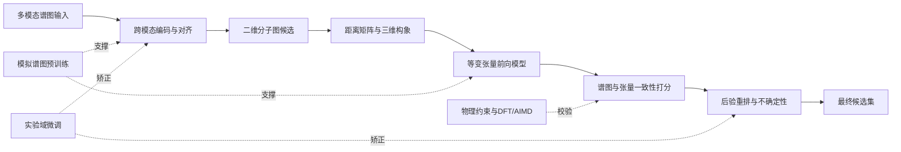

# 多模态谱图驱动分子结构反演方案的文献研究与优化分析

## 执行摘要

基于上传方案，我将问题定位为“多模态谱图驱动的小分子结构反演”。近五年前沿已从单模态检索转向多模态融合、等变三维建模、扩散式图生成与物理后验校验。对你的方案，最值得优先优化的是实验域数据、候选重排、距离几何约束和前向谱图模型的闭环训练。 fileciteturn0file0 citeturn18view3turn20view0turn15search0turn29view0

## 方案定位与假设

用户在问题里没有直接写明领域，但你上传的方案文本本身已经非常清晰：它围绕**多模态谱图输入、分子图生成、距离矩阵/三维坐标恢复、EGNN/TFN 等变建模，以及基于前向谱图与物理约束的后验重排**展开，因此本报告最终收敛到的主分析对象是：**多模态谱图驱动的小分子二维/三维结构反演**。换句话说，这不是泛化意义上的“任意优化”，而是一个典型的**科学机器学习 + 光谱结构解析 + 几何深度学习**交叉问题。 fileciteturn0file0

尽管如此，按你的要求，报告开头仍保留不确定性说明。按相关性从高到低，我认为存在以下三种可能研究方向：

- **多模态谱图到分子结构的自动反演**。最可能相关，因为上传方案直接包含多谱图编码、候选图生成、三维恢复与后验重排闭环。 fileciteturn0file0
- **三维等变分子表示与张量谱预测**。也高度相关，因为方案明确使用 EGNN/TFN 一类等变网络，并把张量响应/前向谱图预测纳入系统。 fileciteturn0file0 citeturn21view1turn21view2turn20view0
- **物理约束的候选生成与后验校准**。同样相关，因为方案不是只做“端到端翻译”，而是强调用前向模型和物理一致性来重排候选后验，这与近年 NMR-Solver、MSNovelist 一类思路很接近。 fileciteturn0file0 citeturn15search0turn25view0

本报告采用的工作假设如下：

| 未指定项 | 本报告采用的假设 |
|---|---|
| 目标领域 | 面向**小分子有机化合物**的多模态谱图结构解析 |
| 输入模态 | 至少包含 IR / NMR / MS，且允许扩展到 Raman / UV / CD / VCD |
| 输出目标 | 先得到二维连接关系，再恢复三维构象，并用后验模型做候选重排 |
| 主要指标 | Top-k exact match、scaffold accuracy、Tanimoto/指纹相似度、谱图相似度、3D RMSD/coverage、化学有效率 |
| 资源条件 | 默认可接受模拟预训练 + 小规模实验微调，而不是纯实验大模型训练 |
| 研究重点 | 优先优化**文献可支持的算法闭环**，而非湿实验或仪器工程本体 |

下面这个 Mermaid 图是我对你方案的抽象重构，便于后文把文献对应到模块上： fileciteturn0file0

## 核心文献地图

从公开文献格局看，和你的方案最贴近的前沿已经形成了一个比较稳定的四层结构：**多模态数据与对齐、直接逆问题求解、等变前向谱图建模、几何/扩散生成与后验物理校验**。但把这四层真正闭成一个“谱图编码→候选生成→3D 恢复→前向谱图校验→后验重排”的统一系统，公开工作仍然不多，这正是你的方案最有差异化的地方。这个判断是我基于下表文献组合做出的归纳。 fileciteturn0file0 citeturn18view3turn23view0turn20view0turn15search0turn29view0

### 核心文献总表

下表按与上传方案的**直接相关性**排序；前半部分偏“逆问题/多模态结构解析”，后半部分偏“几何表示/扩散生成/前向建模基础”。

| 作者 | 年份 | 题目 | 刊物/会议 | 关键词 | 研究方法 | 主要结论 | 可复现性 | 链接 |
|---|---:|---|---|---|---|---|---|---|
| Alberts, Hartrampf, Laino | 2025 | *Automated Structure Elucidation at Human-Level Accuracy via a Multimodal Multitask Language Model* | ChemRxiv / SCS Fall 2025 | 多模态，NMR+IR，结构反演 | 多任务 Transformer；模拟预训练 + 实验微调 | 报告 Top-1 最高可达 96%，说明多模态联合输入能显著提升结构解析上限 | 代码仓已公开提及；流程可部分复现 | DOI: 10.26434/chemrxiv-2025-q80r9；原文/仓库 citeturn10search0turn10search14 |
| Alberts, Schilter, Zipoli, Hartrampf, Laino | 2024 | *Unraveling Molecular Structure: A Multimodal Spectroscopic Dataset for Chemistry* | NeurIPS 2024 Datasets & Benchmarks | 1H/13C/HSQC/IR/MS，多模态数据集 | 790k 分子模拟谱图数据集；提供单模态基准 | 为多模态 foundation model 提供统一数据底座，是此方向最关键的数据型论文之一 | 代码、数据集、基准均公开 | DOI: 10.52202/079017-3996；NeurIPS/数据仓 citeturn19view2turn23view0turn8search16 |
| Jin et al. | 2026 | *NMR-Solver: automated structure elucidation via large-scale spectral matching and physics-guided fragment optimization* | Nature Communications | NMR，物理引导，片段优化 | 大规模谱图匹配 + 物理引导片段优化 + 可解释组装 | 在模拟、文献整理和真实实验上都显示出较强泛化；把“后验物理优化”做成了主干而不是附属步骤 | 论文开放；未见统一官方代码仓 | DOI: 10.1038/s41467-026-71315-0；原文/arXiv citeturn15search0turn15search1 |
| Zou et al. | 2023 | *A deep learning model for predicting selected organic molecular spectra* | Nature Computational Science | DetaNet，IR/Raman/UV/NMR，张量谱 | E(3)-equivariant + self-attention + 张量/标量联合预测 | 证明单个等变网络可统一预测多类有机分子谱与张量性质，是你方案“前向谱图打分器”的最强公开参照之一 | 有 Code Ocean 复现实验环境 | DOI: 10.1038/s43588-023-00550-y；原文/复现环境 citeturn7search0turn7search9 |
| Xu et al. | 2025 | *Pretrained E(3)-equivariant message-passing neural networks with multi-level representations for organic molecule spectra prediction* | npj Computational Materials | EnviroDetaNet，预训练，环境信息 | 等变 MPNN + 分层表示 + 原子环境信息融合 | 对多种谱/张量性质相较 DetaNet 将 MAE 降低 9.77%–52.18%，且 50% 数据下仍稳健 | 论文开放；统一官方代码未明确 | DOI: 10.1038/s41524-025-01698-z citeturn20view0 |
| Rocabert-Oriols et al. | 2025 | *Multi-modal contrastive learning for chemical structure elucidation with VibraCLIP* | Digital Discovery | IR+Raman+graph，对比学习，检索 | 三模态 CLIP 式对齐 + 理论域到实验域轻量微调 | Top-1 retrieval 81.7%，加分子量后 Top-25 达 98.9%，说明“先对齐再重排”非常强 | 开放获取；代码未在官方页明确 | DOI: 10.1039/D5DD00269A citeturn18view4 |
| Alberts, Laino, Vaucher | 2024 | *Leveraging infrared spectroscopy for automated structure elucidation* | Communications Chemistry | IR-only，Transformer，结构翻译 | 634,585 模拟 IR 预训练 + 3,453 实验谱微调 | 在 6–13 重原子分子上 Top-1 44.4%，Top-10 69.8%；scaffold Top-1 84.5% | 模型与数据可获取 | DOI: 10.1038/s42004-024-01341-w；原文/Zenodo citeturn18view1turn17search13 |
| Alberts, Zipoli, Laino | 2025 | *Setting new benchmarks in AI-driven infrared structure elucidation* | Digital Discovery | IR，数据增强，解码策略 | 改进谱图表示、增强与解码的 Transformer | Top-1 63.79%，Top-10 83.95%，显著刷新 IR-only 结构解析基线 | 模型、代码与支撑文件开放 | DOI: 10.1039/D5DD00131E；原文/模型 citeturn18view2turn17search16 |
| Hu et al. | 2024 | *Accurate and efficient structure elucidation from routine one-dimensional NMR spectra using multitask machine learning* | arXiv | 1D NMR，多任务，公式+连接关系 | Transformer + CNN 的端到端 1D NMR 结构解析 | 不依赖分子式时，前 15 个候选中 exact molecule 命中率 69.6%，可将搜索空间缩小至 11 个数量级 | 预印本开放；代码未明确 | arXiv:2408.08284 citeturn16view1 |
| Alberts, Zipoli, Vaucher | 2023 | *Learning the Language of NMR: Structure Elucidation from NMR spectra using Transformer Models* | NeurIPS 2023 Workshop | NMR，Transformer，候选选择 | 直接 NMR→结构 + 候选集选择双任务 | 1H+13C 直接预测 Top-1 为 67.0%，候选选择 Top-1 为 98.28% | 官方页面直接给出代码 | NeurIPS/代码 citeturn18view0 |
| Tan | 2025 | *A transformer based generative chemical language AI model for structural elucidation of organic compounds* | Journal of Cheminformatics | IR+UV+1H NMR，CASE 替代 | 端到端 encoder-decoder Transformer | 最多支持 29 原子分子，Top-15 83%，且 CPU 级秒级推理 | 开放原文；代码未明确 | DOI: 10.1186/s13321-025-01016-1；arXiv:2410.14719 citeturn36search0turn36search1 |
| Stravs, Dührkop, Böcker, Zamboni | 2022 | *MSNovelist: de novo structure generation from mass spectra* | Nature Methods | MS/MS，fingerprint-to-structure | CSI:FingerID + RNN 生成 + 指纹重排 | GNPS 上 first-rank 25%，overall retrieval 45%，证明“先推指纹再生成再重排”对真未知分子有效 | 论文开放；工程生态可复现 | DOI: 10.1038/s41592-022-01486-3 citeturn25view0 |
| Litsa et al. | 2023 | *An end-to-end deep learning framework for translating mass spectra to de-novo molecules* | Communications Chemistry | Spec2Mol，MS/MS，端到端 | 谱图编码器 + SMILES 解码器 | 证明无需依赖数据库即可从 MS/MS 直接推荐候选结构 | 有官方 GitHub | DOI: 10.1038/s42004-023-00932-3；代码 citeturn27search0turn27search2 |
| Bushuiev et al. | 2025 | *MassSpecGym: A benchmark for the discovery and identification of molecules* | arXiv / benchmark | MS/MS，benchmark，de novo/retrieval/simulation | 大规模公开基准 + 统一评测协议 | 首个覆盖 de novo 生成、检索、谱模拟三任务的综合基准 | 数据与 GitHub 均公开 | arXiv:2410.23326 citeturn24view0 |
| Satorras, Hoogeboom, Welling | 2021 | *E(n) Equivariant Graph Neural Networks* | ICML 2021 | EGNN，E(n) 同变 | 无球谐的简洁等变消息传递 | 用更低计算成本实现旋转/平移/反射/置换同变，是大量几何分子模型的通用骨架 | 论文开放；实现众多 | PMLR 139 / ICML 2021 citeturn21view1turn38view0 |
| Schütt, Unke, Gastegger | 2021 | *Equivariant Message Passing for the Prediction of Tensorial Properties and Molecular Spectra* | ICML 2021 | PAINN，张量性质，谱预测 | 旋转等变消息传递 + tensor heads | 相比不变表征更适合传播方向信息，并把分子谱模拟加速到 4–5 个数量级 | 论文开放；工程生态成熟 | PMLR 139 / ICML 2021 citeturn21view2turn38view1 |
| Xu et al. | 2022 | *GeoDiff: A Geometric Diffusion Model for Molecular Conformation Generation* | ICLR 2022 | 构象生成，几何扩散 | 保持等变性的 Markov kernel 扩散 | 在构象生成上达到或超过当时 SOTA，是“3D 恢复”最关键基础之一 | 有社区实现链接 | ICLR 2022 / OpenReview citeturn21view4 |
| Ruiz-Botella, Sales-Pardo, Guimerà | 2025 | *A collaborative constrained graph diffusion model for the generation of realistic synthetic molecules* | arXiv | CoCoGraph，硬约束，化学有效性 | 协同式约束图扩散 | 保证化学有效，参数量更小，生成分布更接近真实分子 | 预印本开放；代码未明确 | arXiv:2505.16365 citeturn29view1 |
| Ninniri, Podda, Bacciu | 2025 | *Graph Diffusion that can Insert and Delete* | NeurIPS 2025 | GrIDDD，动态图大小，条件生成 | 支持节点单调插入/删除的离散图扩散 | 解决传统图扩散无法动态适应分子大小的问题，对条件生成尤其关键 | 论文开放；代码未明确 | NeurIPS 2025 / OpenReview citeturn29view0 |
| Cognolato et al. | 2025 | *D4: Distance Diffusion for a Truly Equivariant Molecular Design* | ESANN 2025 / Neurocomputing 2026 | 距离矩阵，SE(3) 不变，3D 设计 | 基于 distance matrix 的扩散生成 | 用距离矩阵替代坐标，天然满足 SE(3) 不变性，并报告优于 MiDi | 有 GitHub 代码 | ESANN 2025 / 代码 citeturn31search1turn31search2 |

### 补充综述、专利与工程资料

严格相关的“行业白皮书”公开件并不多，产业界更多是以**研究机构官方页面、代码仓、数据描述论文和专利**的形式发布成果。对你的方案最值得补充阅读的综述与专利如下。

| 类型 | 条目 | 价值 | 链接 |
|---|---|---|---|
| 综述 | Lu et al., 2024, *Deep Learning-Assisted Spectrum–Structure Correlation* | 对近五年“谱图—结构”相关深度学习框架做了面向化学家的总综述，适合作为入门导航 | DOI: 10.1021/acs.analchem.4c01639 citeturn14search1turn14search5 |
| 综述 | Hu & Qiu, 2023, *Machine learning-assisted structure annotation of natural products based on MS and NMR data* | 更偏 MS/NMR 结构注释，适合补齐天然产物与实际解析流程的文献脉络 | DOI: 10.1039/D3NP00025G citeturn14search0turn14search20 |
| 综述 | Beck et al., 2024, *Recent Developments in Machine Learning for Mass Spectrometry* | 适合补齐质谱侧的任务划分、评价协议与建模范式 | DOI: 10.1021/acsmeasuresciau.3c00060 citeturn26search15 |
| 专利 | WO2022155597A2, *UV-Vis spectra prediction* | 对“从结构到谱图”的前向预测专利布局最直接，和你方案中的 posterior scorer/forward model 关系较近 | Google Patents citeturn12view0 |
| 专利 | US20200294630A1, *Systems and Methods for Determining Molecular Structures with Molecular-Orbital-Based Features* | 体现了“量子化学/分子轨道特征 + 机器学习”的工程化路线，适合参考特征工程与可解释性思路 | Google Patents citeturn12view1 |
| 专利 | US10605773B2, *Determining molecular and molecular assembly structures from a momentum transfer cross section distribution* | 展示了“实验谱图 + 结构候选 + forward spectrum comparison”式反问题求解的专利化范式，虽然对象更偏 IM-MS/蛋白，但方法学很有借鉴性 | Google Patents citeturn37view0 |

综合这些文献，可以看出一个非常清楚的趋势：**直接逆问题模型越来越强，但真正稳定落地往往离不开候选重排与前向物理校验；前向模型越来越快，但如果没有实验域数据与几何约束，直接反演的泛化仍受限制。**你的方案之所以值得做，恰恰因为它把这两条路线试图闭成一个统一系统。 fileciteturn0file0 citeturn18view3turn20view0turn15search0turn25view0

## 主要优化路线

### 多模态谱图融合与跨模态对齐

这一路线的核心思想，是先把 IR、NMR、MS、Raman 等互补谱图映射到共享表示空间，再做检索、生成或两者混合。Alberts 等的 790k 多模态数据集把 ^1H/^13C/HSQC/IR/MS 放进统一训练框架；VibraCLIP 证明 IR+Raman+分子图三模态对比对齐在检索任务上非常强；而 2025 年的 multimodal multitask 模型表明 NMR+IR 联合输入能把结构解析推到接近专家水平。它的优点是能显著降低单模态歧义，缺点是对**缺失模态、实验域偏移和模态间时间/条件不一致**很敏感。对你的方案而言，这一类方法最适合放在“多模态编码器 + 粗召回/粗排序”阶段。关键指标应优先看 Top-k exact match、scaffold accuracy、retrieval recall、缺失模态鲁棒性曲线。 citeturn23view0turn18view4turn18view3

潜在改进点与实验建议：

- **把全模态训练改成模态 dropout + 缺失模态条件化训练。** 当前最强结果往往建立在完整或受控模态组合上，而真实场景经常只有 NMR+IR、仅 IR、或有 NMR 但无高质量 MS。建议在 790k 多模态数据集上显式构造缺模态训练任务，再用 NMRexp 或实验 IR 子集评估性能退化斜率。 citeturn23view0turn34view0turn18view1
- **把谱图从固定网格输入改为峰集合 token 化。** VibraCLIP 式对齐对“精炼而稳定”的模态表示十分依赖；你的方案若后续纳入 CD/VCD/UV 等模态，使用“峰位、强度、线型、不确定度”作为 token 往往比统一重采样更可扩展。这个建议属于我在现有多模态对齐文献基础上的工程推断。 citeturn18view4turn23view0 fileciteturn0file0

### 直接结构生成与检索生成混合

这一类工作把结构解析直接表述为“谱图到结构”的翻译问题。IR 侧已有从单一 IR 直接翻译结构的 Transformer；NMR 侧有从 routine 1D NMR 直接预测分子式与连接关系的多任务模型，也有从 ^1H/^13C 谱直接做序列生成或候选选择的 Transformer；MS 侧则有 Spec2Mol、MSNovelist 这样的 end-to-end 生成或“指纹→结构生成→重排”路线。它们的共同优点是**速度快、候选空间压缩强**，共同缺点则是**原子数上限、实验域偏移和 stereochemistry 细节**仍是瓶颈。适用场景是：需要直接给出 top-k 候选，或者需要在粗检索后快速生成新颖分子候选。关键指标应看 Top-1/Top-5/Top-10 exact match、scaffold hit、候选多样性、推理耗时。 citeturn18view1turn18view2turn16view1turn18view0turn36search0turn25view0turn27search0

潜在改进点与实验建议：

- **从“纯生成”升级为“检索 + 生成 + 后验物理重排”的混合系统。** MSNovelist 之所以稳，不在于只生成，而在于加入指纹/概率重排；NMR-Solver 之所以强，也在于谱图匹配和片段优化耦合。对你的方案，最自然的升级方式不是盲目追求更大的 decoder，而是先检索 scaffold/fragment，再做条件生成。 citeturn25view0turn15search0turn28view0
- **显式把“候选集质量”作为目标，而非只优化单个 Top-1。** 现有很多论文汇报 Top-1/Top-10，但真正实验室可用的是“前若干候选里是否有可验证真解”。建议你把 beam diversity、posterior calibration、candidate coverage 纳入训练目标与报告指标。这个建议来自对 MSNovelist、NMR-Solver 与多任务 NMR 文献的综合判断。 citeturn25view0turn15search0turn16view1

### 等变几何表示与张量前向模型

这是与你方案中 EGNN/TFN/张量响应模块最贴近的一条路线。EGNN 用较低代价实现 E(n) 同变；PAINN 把方向信息和张量性质一并纳入消息传递；DetaNet 首次非常系统地把 IR、Raman、UV-Vis、^1H/^13C NMR 以及多类张量性质放进统一等变网络；EnviroDetaNet 则进一步把原子环境、多层表示和预训练引入谱图预测。简单说，这一路线解决的是：**给定结构，如何快速、准确、几何一致地预测谱图或张量响应**。它的优点是物理一致性强、可作为后验 scorer，缺点是仍然受限于构象、溶剂、温度以及实验条件。适合你的方案中“前向谱图模拟器”“张量响应头”和“结构—谱图一致性打分器”。关键指标应看 MAE、R²、Spearman、谱图相似度、张量不变量误差以及跨化学空间外推能力。 citeturn21view1turn21view2turn7search0turn20view0

潜在改进点与实验建议：

- **从单构象输入升级为构象集合/热平均输入。** NMRexp 明确指出实验域与模拟域存在系统差异；IR-NMR 177k 数据集也强调通过 MD + DFT + ML 生成更接近真实的 anharmonic/热采样谱图。对于你的方案，如果 forward scorer 只看单一 3D 构象，重排质量大概率会被上限锁死。 citeturn34view0turn19view1turn20view0
- **把多模态 forward heads 做成“共享几何骨干 + 模态特异不确定度头”。** DetaNet/EnviroDetaNet 说明共享几何表示是可行的，但公开文献中把这种张量前向模型进一步纳入逆问题后验闭环的工作仍不多。对你而言，这是很有潜力的差异化方向，尤其适合接入 UV/CD/VCD 等对手性和三维敏感的谱。这个结论是我基于现有公开工作所做的推断。 citeturn7search0turn20view0 fileciteturn0file0

### 距离几何与大小自适应图扩散

你的方案里最“前沿”的部分之一，是从分子图到距离矩阵再到 3D 坐标的中间表征设计。GeoDiff 代表的是在坐标空间做等变扩散的主流路线；D4 则强调直接对**距离矩阵**建模，天然满足 SE(3) 不变性；CoCoGraph 把硬约束嵌到图扩散中，强调化学有效性；GrIDDD 进一步解决了传统图扩散不能随条件动态增删节点的问题。它们共同指向一个事实：**仅靠固定节点数的离散图生成，已经不足以支撑复杂条件下的分子结构反演与优化。**对你的方案，这一路线最适合部署在“候选图→距离矩阵→3D 恢复”阶段。关键指标要看 validity、uniqueness、novelty、property targeting success，以及如果涉及 3D，则看 RMSD、coverage、matching 与手性一致性。 citeturn21view4turn31search1turn29view1turn29view0

潜在改进点与实验建议：

- **对距离矩阵施加显式的几何可实现性约束。** D4 的价值就在于把距离作为原生 SE(3) 不变量来建模；这启发你在 distance diffusion 阶段加入三角不等式、秩/Gram 一致性或坐标可恢复性的软硬约束，而不是把距离矩阵仅当作普通图像去拟合。 citeturn31search1turn31search8
- **把“大小可变”与“硬化学约束”合并到同一生成器里。** CoCoGraph 证明硬约束能显著改善化学有效性，GrIDDD 证明增删节点对条件生成非常重要。你若想让谱图真正决定分子大小、环系复杂度和官能团数目，建议把二者结合成一个 size-adaptive constrained diffusion baseline。 citeturn29view1turn29view0

### 物理约束后验重排与校准

我认为这是与你方案最契合、也最可能在短中期内带来实质收益的一条路线。MSNovelist 的关键不只是生成，而是最后用 predicted fingerprint 做重排；NMR-Solver 的关键也不只是搜索，而是把谱图匹配与 physics-guided fragment optimization 做成了可解释闭环。你上传的方案同样把前向谱图预测与后验评分放到系统后段，这与当前公开最有效的落地方向一致。它的优点是**能显著提升可靠性**，缺点是需要一个高质量、速度足够快的 forward model，以及合理的不确定性建模。对你的方案而言，这一模块既可以服务于 top-k 重排，也可以服务于 active learning。关键指标应看 rerank 之后的 Top-1/Top-k 提升、校准误差、错误分布可解释性与跨实验域鲁棒性。 fileciteturn0file0 citeturn25view0turn15search0turn7search0turn20view0

潜在改进点与实验建议：

- **采用“两级后验”而不是单级打分。** 第一级用 DetaNet/EnviroDetaNet 一类快速前向模型在 top-k 上做批量评分；第二级只对分歧最大的少数候选调用更重的 DFT/AIMD 或高保真张量计算。这样更符合实验室计算预算，也更匹配 NMR-Solver 的“先粗后精”思想。 citeturn15search0turn20view0turn7search0
- **做模态加权的贝叶斯式后验校准。** 不同模态的信息密度不同，且实验质量差异很大。建议在后验层显式学习每种模态的置信度权重，再比较“均匀加权”“固定规则加权”“学习式加权”三者的 Top-1 提升和校准误差。这个建议是对现有“多模态输入 + 后验打分”文献的系统延伸。 citeturn18view3turn18view4turn15search0

## 研究空白与优先级建议

当前公开文献的共同短板，集中在四个层面。第一，**实验域多模态数据仍明显不足**：790k 多模态大库和 177k IR-NMR 数据集都以模拟数据为主，而大规模开放实验数据直到 2025 年的 NMRexp 才显著扩张。第二，**很多直接反演模型的分子规模上限仍偏小**，例如 IR-only 论文主要针对 6–13 重原子，1D NMR 工作扩到 19 重原子，Transformer CASE 工作扩到 29 原子，但与真实实验室复杂样品仍有差距。第三，**stereochemistry 与细微 3D 差异**仍是公开系统的薄弱环节，NMRexp 也明确指出立体识别与 OCR/标注本身存在限制。第四，**公开工作经常在“逆问题”或“前向模型”单点做强，却没有把物理后验变成统一闭环主干**。这正是你的方案最有机会填补的空白。 citeturn23view0turn19view1turn34view0turn18view1turn16view1turn36search0

### 优先级清单

下表给出我建议的研究推进顺序。这里的“收益”和“难度”是结合文献成熟度、复现实验成本和与你方案的贴合度做出的分析判断。

| 时间窗 | 建议任务 | 预期收益 | 实施难度 | 说明 |
|---|---|---|---|---|
| 短期 | 建立统一基准：以 790k 多模态数据集 + NMRexp + 小规模实验 IR/NMR 子集，做“单模态/双模态/多模态”统一评测 | 很高 | 中 | 先把基准建好，后续所有优化才能可比；这是最高 ROI 的第一步 |
| 短期 | 做一个“检索 + 生成 + posterior rerank”的强基线 | 很高 | 中 | 可直接验证你的方案里后验重排是否真正带来收益，而不是只靠 backbone 变强 |
| 短期 | 引入模态 dropout 与峰 token 化编码器 | 中高 | 中 | 对真实实验的缺模态场景最有帮助，也利于扩展 CD/VCD/UV 等模态 |
| 中期 | 把图生成与 distance diffusion 联训，并加入硬化学约束 | 很高 | 高 | 这一步决定你的方法是否能在 2D/3D 一致性上形成真正优势 |
| 中期 | 用 DetaNet/EnviroDetaNet 类 forward model 做 top-k 物理打分 | 很高 | 中高 | 这会显著提高候选排序可靠性，是从“可生成”走向“可用”的关键 |
| 中期 | 做 synthetic-to-experimental domain adaptation | 高 | 高 | 文献中最常见失败点就是从模拟到实验的域偏移；如果你解决这一点，价值会很大 |
| 长期 | 做“共享几何骨干 + 多模态谱图头 + 张量响应头”的 foundation model | 极高 | 很高 | 这是与你方案最匹配、也最具有论文新意的长期方向 |
| 长期 | 引入主动学习闭环：用后验不确定性筛选样本，回流 DFT/AIMD/人工验证 | 高 | 很高 | 一旦构成自动改进闭环，方案会从“模型”升级为“系统” |

如果只允许我给出一句最直接的优先级结论，那就是：**先不要急着把生成器继续做大，而应先把“实验域桥接 + 后验重排 + forward 物理校验”做扎实。**公开文献已经反复说明，可靠结构解析的真正瓶颈常常不在 decoder，而在闭环。 citeturn15search0turn25view0turn20view0turn34view0

## 检索策略与推荐原文

### 检索策略

本报告的实际检索采用“**方案分解式检索**”：先从上传方案中拆出模块，再按模块查文献。模块包括：**多模态数据/融合、直接逆问题求解、前向谱图预测、等变几何表示、图/距离扩散、后验物理重排、专利/工程资料**。 fileciteturn0file0

复现检索时，我建议按下表执行：

| 数据库或来源 | 主要用途 | 检索词示例 |
|---|---|---|
| arXiv | 最新预印本、基准、方法起点 | `"multimodal spectroscopic dataset chemistry"`, `"structure elucidation NMR transformer"`, `"MassSpecGym"` |
| OpenReview | ICLR/NeurIPS 一线会议方法 | `"GeoDiff molecular conformation"`, `"graph diffusion insert and delete"`, `"MADGEN mass spec de novo"` |
| PMLR | ICML 等基础模型原文 | `"E(n) Equivariant Graph Neural Networks"`, `"Equivariant Message Passing molecular spectra"` |
| Nature / Communications Chemistry / Nature Methods / Nature Computational Science / npj / Scientific Data | 高影响原始论文、开放数据集 | `"NMR-Solver nature"`, `"DetaNet spectra"`, `"NMRexp experimental NMR spectra"` |
| RSC Digital Discovery / Chemical Science / Natural Product Reports | 结构解析、综述、开放获取论文 | `"infrared structure elucidation digital discovery"`, `"VibraCLIP"`, `"structure annotation MS NMR review"` |
| IBM Research / GitHub / Zenodo | 代码、模型、数据和工业侧官方页面 | `"MultimodalAnalytical IBM"`, `"Leveraging infrared spectroscopy Zenodo"`, `"D4 distance diffusion github"` |
| Google Patents / CNIPA / CNKI | 相关专利与中文补充检索 | `"spectra to structure patent"`, `"谱图 结构解析 机器学习"`, `"分子 光谱 预测 专利"` |

建议的中文检索词可以直接使用以下组合：

- “多模态 谱图 分子 结构解析”
- “核磁 红外 质谱 机器学习 结构反演”
- “等变 图神经网络 分子 光谱 预测”
- “距离矩阵 扩散 分子 设计”
- “物理约束 后验 重排 分子 结构”

### 筛选标准与时间范围

| 维度 | 筛选标准 |
|---|---|
| 时间范围 | 主体检索为 **2016-01-01 至 2026-05-18**；优先 **2021–2026**；仅为补足方法学基础时回看 2018–2020 |
| 文献类型 | 优先原始论文、重要会议论文、官方数据论文、官方代码仓、专利；综述用于搭建脉络，不作为唯一证据 |
| 相关性 | 必须直接服务于你的闭环中的至少一个模块：多模态编码、结构反演、3D 恢复、前向谱图、图扩散、后验重排 |
| 质量 | 优先官方来源、开放获取、带 DOI、可直接访问；优先有代码/数据或清晰实验协议的工作 |
| 排除项 | 纯药效/性质生成而无谱图关系的论文；只做一般分子表示学习而不涉及谱图/几何/生成的论文；与小分子解析弱相关的宏观工艺优化论文 |

### 推荐直接访问的原始文献

下面这些条目最适合你先下载原文，因为它们要么是**数据基座**，要么是**与你方案闭环最贴近的主干方法**，要么是**直接可复现实验入口**。

| 文献 | 为什么优先推荐 | 访问入口 |
|---|---|---|
| *Unraveling Molecular Structure: A Multimodal Spectroscopic Dataset for Chemistry* | 这是当前公开最关键的多模态结构解析数据底座之一；没有它，很难系统比较多模态融合策略 | 原文/数据集 citeturn19view2turn8search16 |
| *Automated Structure Elucidation at Human-Level Accuracy via a Multimodal Multitask Language Model* | 和你的方案最贴近的直接参照，尤其适合比较“多模态直解”和“后验闭环”的边界 | ChemRxiv/官方仓 citeturn10search0turn10search14 |
| *NMR-Solver* | 物理引导片段优化 + 谱图匹配的闭环范式，最适合参考你的 posterior 设计 | Nature Communications / arXiv citeturn15search0turn15search1 |
| *A deep learning model for predicting selected organic molecular spectra* | 你的前向谱图 scorer 最该先读的论文之一；它提供了统一多谱种 forward model 的高质量原型 | Nature Computational Science / Code Ocean citeturn7search0turn7search9 |
| *Pretrained E(3)-equivariant message-passing neural networks with multi-level representations for organic molecule spectra prediction* | 如果你要做更强的几何 forward model，这篇是 DetaNet 之后最直接的升级参照 | npj Computational Materials citeturn20view0 |
| *Setting new benchmarks in AI-driven infrared structure elucidation* | 最容易直接复现的单模态强基线之一，适合先跑通“谱图→结构”的最简闭环 | 原文/模型/补充材料 citeturn18view2turn17search16 |
| *NMRexp: A database of 3.3 million experimental NMR spectra* | 如果你后续要做实验域微调或 domain adaptation，这篇几乎是必读且必下的数据论文 | Scientific Data / Zenodo citeturn34view0turn33search1 |
| *Spec2Mol* | 适合补齐 MS/MS 端到端生成路线，同时有官方 GitHub，便于快速做跨模态模块接入 | 原文/GitHub citeturn27search0turn27search2 |
| *MassSpecGym* | 适合给质谱子任务建立标准评测；当你以后加上 MS 模态时，很适合做公开基准 | 原文/GitHub citeturn24view0 |

如果你只想先抓“最值得精读”的五篇，我会优先建议：**Multimodal Dataset 2024、Multimodal Multitask 2025、NMR-Solver 2026、DetaNet 2023、NMRexp 2025**。这五篇基本对应了你方案的**数据、逆问题、后验物理、前向谱图、实验域**五个关键支点。 citeturn19view2turn10search0turn15search0turn7search0turn34view0